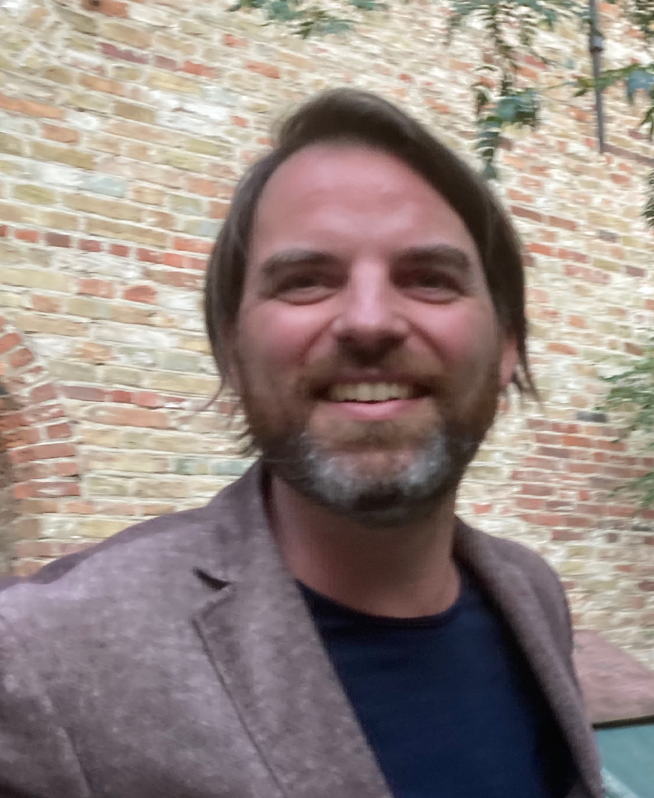

---
format:
  html:
    toc: false
    number-sections: false
    code-tools: false
---

# Instructors

### Lieven Clement

Lieven Clement is an Associate Professor of Statistical Genomics at Ghent University, where he leads the [statOmics](https://statomics.github.io/) Group. He is an expert in developing statistical methods and open source tools for differential omics data analysis. His research efforts resulted in numerous publications on novel methods and tools for, and applied research in omics data analysis. His lab is built around two strategic research pillars each connected to an omics domain: (single cell) transcriptomics and proteomics and he has a strong interest in leveraging his expertise to translational research. He also serves as a member of the core team that established a new Master of Science in Bioinformatics at Ghent University and as a board member of the Belgian Proteomics Association.

Affiliation: Department of Applied Mathematics, Computer Science and Statistics, Ghent University, Ghent, BE

 
 
 

### Luca De Corso 

Affiliation: Department of Applied Mathematics, Computer Science and Statistics, Ghent University, Ghent, BE

