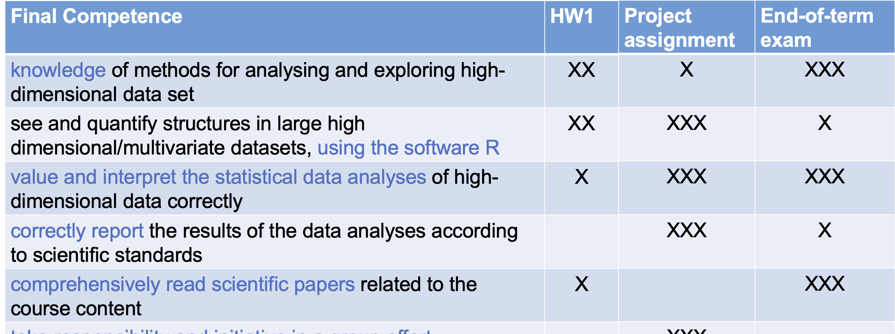

# Organisation
## Lectures

- Theory (6-7 x 2.5 hours)
- Paper reading sessions (1 x 2.5hours)
- Q&A session (2.5 hours)
- PC Labs (6 x 2.5 hours)
- Project work (2 x 2.5 hours)

## Instructors 

- Lectures: Lieven Clement (lieven.clement@ugent.be)
- Tutorials: Yao Chen (yao.chen@ugent.be)

# Evaluation

## End-of-term evaluation

- Exam in January: 10/20
- Written open book exam with open questions

## Non-period evaluation 

- 1 Project (7.5) + 1 homework (2.5): 10/20
- Written reports
- Group work: 
    - project 4 people, 
    - homework 2 people

# Competences
## Initial competences

- A basic course in probability theory and statistics (linear models, i.e, regression analysis and analysis of variance)
- Good basic knowledge of matrix algebra

## Final competences

1. The student has knowledge of methods for analysing and exploring high-dimensional data sets
2. The student can see and quantify structures in large high dimensional/multivariate datasets, using the
software R.
3. The student can value and interpret the statistical data analyses of high-dimensional data correctly.
4. The student can correctly report the results of the data analyses according to scientific standards
5. The student can comprehensively read scientific papers related to the course content.
6. The student can take responsibility and initiative in a group effort

